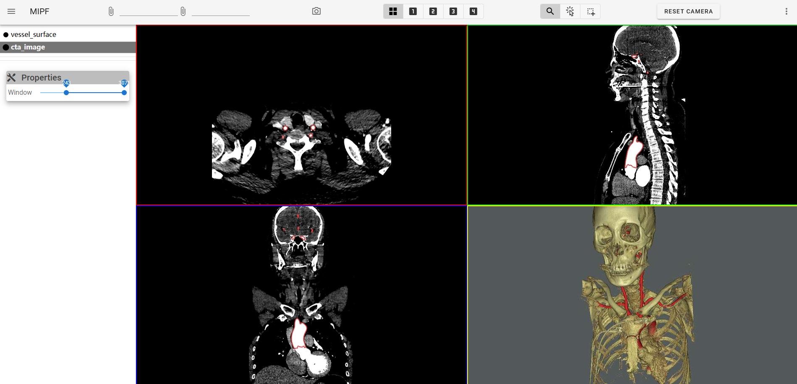
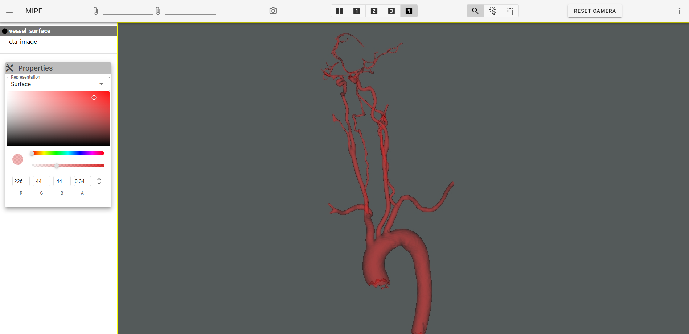
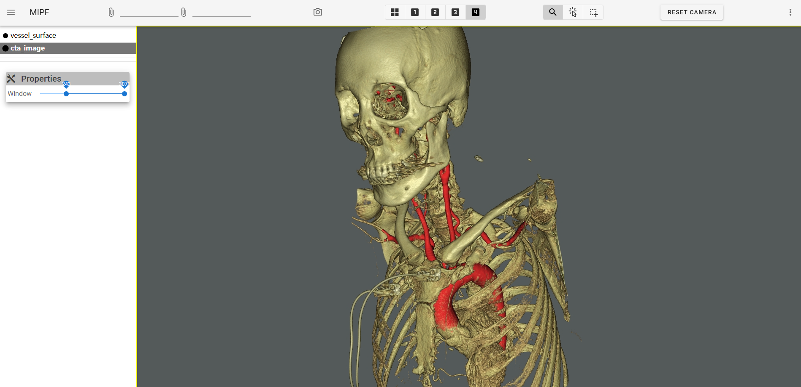
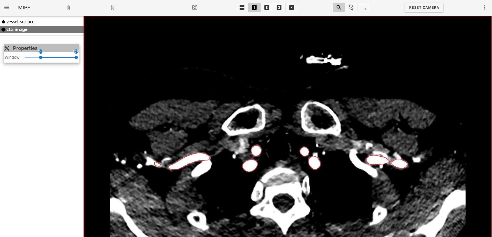

# MIPF

MIPF (Medical Image Processing Framework) is a python library based on [trame](https://github.com/Kitware/trame), primarily designed for medical image processing and visualization. Its architecture is inspired by [MITK(Medical Imaging Interaction Toolkit)](https://github.com/MITK/MITK)  and supports loading, browsing, and interacting with medical imaging data.

These are some simple examples and more features are under development.

